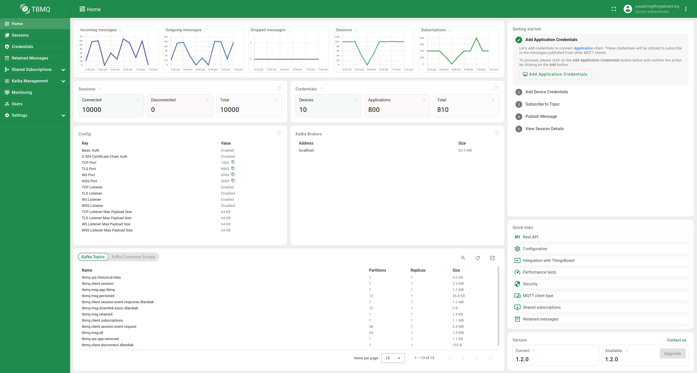

# TBMQ

TBMQ represents an open-source MQTT message broker with the capacity to handle up to **4M** concurrent client connections, 
while proficiently processing a minimum of **200K messages per second** per single cluster node. 
In the cluster mode, its capabilities are further enhanced, enabling it to effortlessly support more than **100M** concurrently connected clients 
and handle more than [3M messages per second](https://thingsboard.io/docs/mqtt-broker/reference/performance-tests/).

Within the ThingsBoard company, our expertise and understanding of diverse IoT requirements and use cases have enabled us 
to discern two primary scenarios in which our clients develop their solutions.
The first scenario entails numerous devices generating a substantial volume of messages that are consumed by specific
applications, resulting in a fan-in pattern.
Conversely, the second scenario involves numerous devices subscribing to specific updates or notifications,
leading to a few incoming requests that necessitate a high volume of outgoing data, known as a fan-out pattern.
Acknowledging these scenarios, we purposefully designed TBMQ to be exceptionally well-suited for both.

Moreover, our design principles focused on ensuring the broker’s reliability, speed, and efficiency while addressing
crucial requirements.
These include the imperative of facilitating rapid message consumption and persistence, guaranteeing low-latency
delivery of messages to clients,
and providing the ability to withstand peak loads from publishing clients, all while ensuring backup storage for offline
clients.
Additionally, we prioritized supporting distributed and partitioned processing, allowing for seamless scalability as our
operations expand.
Crucially, we sought to implement a fault-tolerant mechanism for message processing, capable of handling potential
failures that may arise among the participants in the data flow.

TBMQ provides compatibility with both MQTT v3.x and v5.0 protocols.
Last but not least, it had been running in production for more than a year before being open-sourced.

## Documentation

TBMQ documentation is hosted on [thingsboard.io](https://thingsboard.io/docs/mqtt-broker/).

## Getting Started

Connect clients and Publish your IoT data in minutes by following
this [guide](https://thingsboard.io/docs/mqtt-broker/getting-started/).

## Licenses

This project is released under [Apache 2.0 License](./LICENSE).

## MQTT 5 supported features:

- User Properties
- Reason Codes for MQTT packets
- Session Clean Start
- New Data Type: UTF-8 String pairs
- Bi-directional DISCONNECT packets
- Using passwords without usernames
- Session expiry feature
- Shared subscriptions
- Subscription options
- Maximum Packet Size
- Will delay
- Server Keep-Alive
- Assigned ClientID
- Server reference

## MQTT 5 features in active development:

- AUTH packet & Enhanced Authentication
- Message expiry feature
- Topic aliases
- The payload format and content types
- Request / Response & Correlation Data
- Flow Control
- Subscription Identifiers
