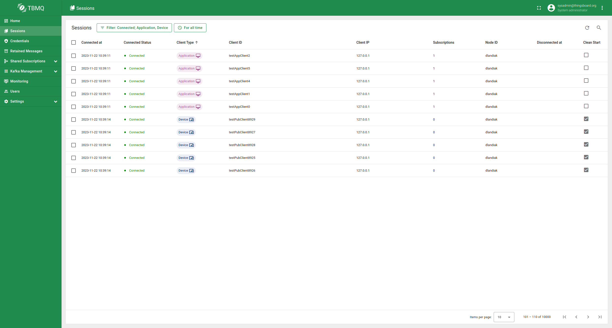

# TBMQ

[![TBMQ Builds Server Status](https://img.shields.io/teamcity/build/e/TBMQ_Build?label=TB%20builds%20server&server=https%3A%2F%2Fbuilds.thingsboard.io&logo=&labelColor=305680)](https://builds.thingsboard.io/viewType.html?buildTypeId=TBMQ_Build&guest=1)

TBMQ represents an open-source MQTT message broker with the capacity to handle **4M+** concurrent client
connections, supporting a minimum
of [3M messages per second throughput](https://thingsboard.io/docs/mqtt-broker/reference/3m-throughput-single-node-performance-test/)
per single cluster node with low latency delivery.
In the cluster mode, its capabilities are further enhanced, enabling it to support more than [100M
concurrently connected clients](https://thingsboard.io/docs/mqtt-broker/reference/100m-connections-performance-test/).

At ThingsBoard, we've gained a lot of experience in building scalable IoT applications, which has helped us identify
three main scenarios for MQTT-based solutions.

* In the first scenario, numerous devices generate a large volume of messages that are consumed by specific
  applications, resulting in a **fan-in** pattern.
  Normally, a few applications are set up to handle these lots of incoming data. It must be ensured that they do not
  miss any single message.

  

* The second scenario involves numerous devices subscribing to specific updates or notifications that must be delivered.
  This leads to a few incoming requests that cause a high volume of outgoing data.
  This case is known as a **fan-out (broadcast)** pattern.

  

* The third scenario, **point-to-point (P2P)** communication, is a targeted messaging pattern, primarily used for
  one-to-one communication.
  Ideal for use cases such as private messaging or command-based interactions where messages are routed between a single
  publisher and a specific subscriber through uniquely defined topics.

  

> In all scenarios, persistent clients with a Quality of Service (QoS) level set to 1 or 2 are often utilized to ensure
> reliable message delivery, even when they're temporarily offline due to restarts or upgrades.

Acknowledging these scenarios, we intentionally designed TBMQ to be exceptionally well-suited for all three.

Our design principles focused on ensuring the broker’s fault tolerance and high availability. Thus, we deliberately
avoided reliance on master or coordinated processes. We ensured the same functionality across all nodes within the
cluster.

We prioritized supporting distributed processing, allowing for effortless horizontal scalability as our operations grow.
We wanted our broker to support high-throughput and guarantee low-latency delivery of messages to clients. Ensuring data
durability and replication was crucial in our design. We aimed for a system where once the broker acknowledges receiving
a message, it remains safe and won’t be lost.

TBMQ provides full compatibility with both MQTT v3.x and v5.0 protocols.
Last but not least, it had been running in production for more than a year before being open-sourced.

## Supported features:

- All MQTT v3.x features
- All MQTT v5.0 features
- Multi-node cluster support
- X.509 certificate chain authentication support
- Access control (ACL) based on client ID, username, or X.509 certificate chain
- REST query support for clients’ sessions and subscriptions
- Rate limits of message processing
- Cluster and clients' metrics monitoring
- Unauthorized clients
- MQTT WebSocket client
- Integrations with external systems (HTTP, MQTT, Kafka)
- Kafka topics and consumer groups monitoring

## Documentation

TBMQ documentation is hosted on [thingsboard.io](https://thingsboard.io/docs/mqtt-broker/).

## Getting Started

Connect clients and Publish your IoT data in minutes by following
this [guide](https://thingsboard.io/docs/mqtt-broker/getting-started/).

## Installation

Review different TBMQ installation options by
following [this link](https://thingsboard.io/docs/mqtt-broker/install/installation-options/).

## Licenses

This project is released under [Apache 2.0 License](./LICENSE).
